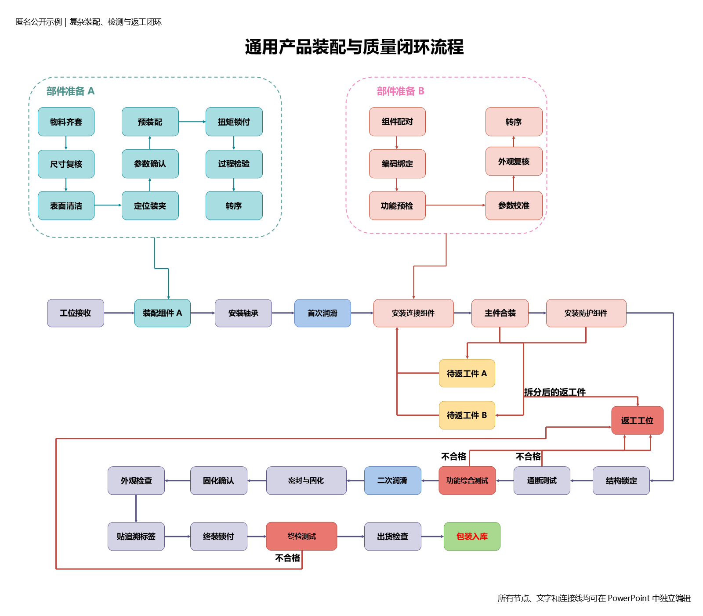

# diagram-to-ppt

将架构图、流程图和组织结构图截图重绘为原生可编辑 PowerPoint 的 Agent Skill。

> 这不是传统的图片自动矢量化工具。重绘质量主要取决于宿主 LLM 是否能够看懂图片、准确读取文字、理解连接关系，并根据渲染预览反复修正。

## 重绘效果对比

以下是一个完全虚构的复杂装配与质量闭环示例，不包含真实项目、客户、设备或业务数据。左侧是交给 Agent 的输入 PNG，右侧是原生可编辑 PPTX 经 Microsoft PowerPoint 导出的实际结果。

| 输入 PNG | 可编辑 PPTX 的 PowerPoint 渲染结果 |
|---|---|
|  |  |

[下载原生可编辑 PPTX 示例](examples/complex-assembly-flow/editable.pptx) · [查看结构化 Manifest](examples/complex-assembly-flow/manifest.json)

该示例包含双分区准备流程、主装配链、返工件拆分、跨区回流、两轮测试和多条不合格闭环。最终 PPTX 共 112 个原生对象、46 个文本对象和 64 条连接线段，图片对象为 0，PowerPoint 实际渲染文字溢出为 0。

## 使用前提

使用该 Skill 的 Agent 必须具备以下能力：

1. **多模态视觉**：能够直接查看 PNG、JPG、JPEG 或截图，而不是只能读取文件路径。
2. **图中文字读取**：能够识别标题、节点文字、连接线标签、图例、数字、缩写及中英文混排内容。
3. **空间与结构理解**：能够判断容器、节点、层级、分支、回路、连接方向和箭头语义，并估算其在源图中的位置。
4. **文件与脚本操作**：能够创建 JSON manifest、运行 Python/PowerShell 脚本并写出 `.pptx`、PNG 和 JSON 文件。
5. **视觉复核**：能够查看 PowerPoint 渲染预览，将其与源图对照，并根据差异继续修改，而不是只检查代码是否执行成功。

如果宿主 LLM 不能直接查看图片，或者不能查看生成后的预览图，这个 Skill 无法可靠工作。

## 运行环境

- Python 3.10+
- Python 包：`python-pptx`、`Pillow`、`numpy`
- Windows + Microsoft PowerPoint：可选，用于真实 PowerPoint 渲染和文字边界验收
- 其他系统仍可生成和检查 PPTX，但需要自行提供可用的幻灯片渲染方式完成视觉验收

安装 Python 依赖：

```bash
python -m pip install python-pptx Pillow numpy
```

## 适用范围

- 软件或工业系统架构图
- 业务流程图、工艺流程图、审批流程图
- 组织结构图和层级关系图


## 使用方式

将本目录安装到 Agent 的 Skills 目录，然后向支持该 Skill 的宿主提出类似请求：

```text
Use $diagram-to-ppt to redraw this flowchart image as an editable PowerPoint slide.
```

宿主 LLM 负责看图、读取文字和理解结构；Skill 提供 manifest 规范、原生 PPT 渲染脚本和验收流程。Skill 不内置 OCR，也不以整页图片或图片切片冒充可编辑重绘。

## 输出

- 原生可编辑 `.pptx`
- 结构化 manifest
- PowerPoint 渲染预览
- 源图与重绘图对照图
- 结构、文字边界和视觉差异 QA JSON

## 质量边界

- 所有可见文字必须是 PowerPoint 文本对象。
- 节点、容器、图标和连接线必须使用可独立选择的原生对象。
- 看不清的文字必须标记为不可读，禁止猜测。
- 结构检查通过不代表视觉验收通过；必须查看真实渲染结果。
- 高密度、小字号、低清晰度或严重压缩的源图会显著降低重绘准确率，优先提供高清原图。
